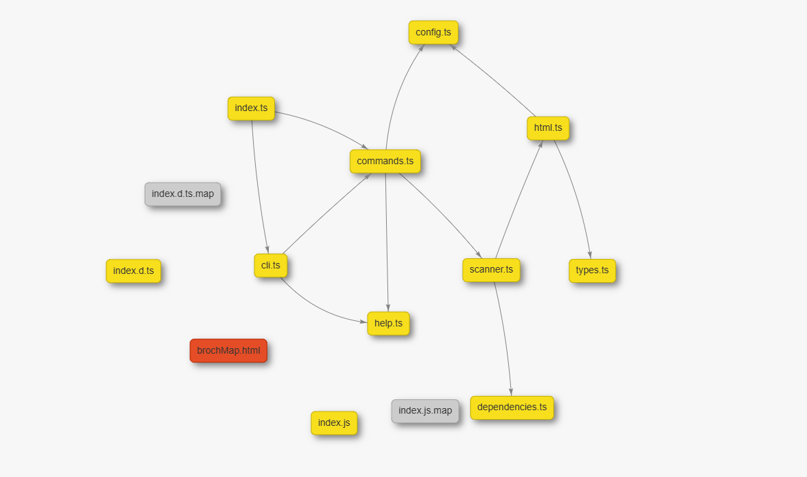

<div align="center">

<p align="center">  </p>

<h1 align="center">Broch</h1>

<p align="center">
    
    
    
    
    
</p>

<p align="center">
    <a href="README.md">English</a> |
    <a href="README.es.md">Español</a> |
    <a href="README.zh.md">中文</a> |
    <a href="README.ja.md">日本語</a>
</p>

<p align="center"> <strong>プロジェクトのアーキテクチャをシンプルかつインタラクティブに視覚化します。</strong> </p>

## 📑 目次
- [主な機能](#-主な機能)
- [インストール](#-インストール)
- [コマンド](#️-コマンド)
    - [map](#map)
    - [preview](#preview)
    - [version](#version)
    - [help](#help)
- [設定](#-設定)
- [ライセンス](#-ライセンス)
- [Broch への貢献](#-broch-への貢献)
- [行動規範](#-行動規範)
- [クイックコマンド](#-クイックコマンド)
- [フッターリンク](#-フッターリンク)

Broch はコマンドラインインターフェース（CLI）ツールで、プロジェクトの構造を解析してインタラクティブな依存関係マップを生成します。Broch を使えば、ファイル間のつながりを視覚的に把握でき、コードの理解、保守、デバッグが容易になります。

## ✨ 主な機能
自動依存解析: JavaScript、TypeScript、HTML、CSS、PHP のファイルで import、require、include などの関係を検出します。

インタラクティブな視覚化: vis-network を使った動的な HTML マップを生成し、プロジェクトの接続を直感的に探索できます。

高いカスタマイズ性: broch.config.json により色、ラベル、出力ファイル名を簡単に設定できます。

使いやすさ: 数コマンドでプロジェクトの構成全体を確認できます。

## 🚀 インストール
Broch を使用するには、Node.js（バージョン 12 以上）をインストールしてください。その後、npm を使ってグローバルにインストールします:

```bash
npm i -g broch
```

グローバルインストールすることで、任意のディレクトリから broch コマンドを実行できます。

## ⚙️ コマンド
Broch の使い方はとてもシンプルです。利用可能なコマンドは以下の通りです。

```bash
broch map
```
これは Broch の中核となるコマンドです。ディレクトリをスキャンして依存関係マップを生成します。

エイリアス:
```bash
broch m
```

使用例:

選択したディレクトリをスキャンする: プロジェクトルートでコマンドを実行すると、現在のディレクトリ一覧が表示され、生成したいディレクトリを選択できます。



##

```bash
broch preview
```
マップを生成した後、このコマンドでブラウザで直接開くことができます。

エイリアス:
```bash
broch p
```

使用例:

このコマンドは brochMap.html（または設定で指定した名前）のファイルを探して開きます。

##

```bash
broch version
```

インストールされている Broch のバージョンを表示します。

エイリアス:

```bash
broch v
```

##

```bash
broch
```
```bash
broch help
```
利用可能なコマンドとオプションの概要を表示します。

エイリアス:
```bash
broch h
```

## 🔧 設定 (broch.config.json)

```json
{
    "outputFileName": "brochMap.html",
    "colors": {
        "html": "#E44D26",
        "css": "#1572B6",
        "js": "#F7DF1E",
        "php": "#777BB4",
        "image": "#4CAF50",
        "rust": "#DE3423",
        "json": "#000000",
        "yml": "#cb171e",
        "md": "#000000",
        "py": "#3776AB",
        "java": "#b07219",
        "other": "#CCCCCC"
    },
    "labels": {
        "js": "JS/TS",
        "yml": "YML",
        "md": "Markdown",
        "py": "Python",
        "java": "Java"
    }
}
```

##

初回実行時に、broch.config.json ファイルが自動的に作成されます。このファイルでツールの挙動をカスタマイズできます。

outputFileName: 生成される HTML ファイルの名前を指定します。

colors: 各拡張子に対して色を割り当てます。必要に応じて追加・変更してください。

labels: マップの凡例で表示するラベルをカスタマイズできます。

## 📄 ライセンス MIT
Copyright © 2025 Jan Queralt

Hereby, permission is granted, free of charge, to any person obtaining a copy
of this software and associated documentation files (the "Software"), to deal
in the Software without restriction, including without limitation the rights
to use, copy, modify, merge, publish, distribute, sublicense, and/or sell
copies of the Software, and to permit persons to whom the Software is
furnished to do so, subject to the following conditions:

The above copyright notice and this permission notice shall be included in all
copies or substantial portions of the Software.

THE SOFTWARE IS PROVIDED "AS IS", WITHOUT WARRANTY OF ANY KIND, EXPRESS OR
IMPLIED, INCLUDING BUT NOT LIMITED TO WARRANTIES OF MERCHANTABILITY,
FITNESS FOR A PARTICULAR PURPOSE AND NONINFRINGEMENT. IN NO EVENT SHALL THE
AUTHORS OR COPYRIGHT HOLDERS BE LIABLE FOR ANY CLAIM, DAMAGES OR OTHER
LIABILITY, WHETHER IN AN ACTION OF CONTRACT, TORT OR OTHERWISE, ARISING FROM,
OUT OF OR IN CONNECTION WITH THE SOFTWARE OR THE USE OR OTHER DEALINGS IN THE
SOFTWARE.

# 🤝 Broch への貢献

まず最初に、Broch への貢献に感謝します！皆さんの協力がプロジェクトをより良くします。

バグ報告、機能提案、ドキュメント改善、コードの強化など、あらゆる貢献を歓迎します。

## 貢献方法

### バグ報告や機能提案
新しい Issue を作成する前に、[Issues ページ](https://github.com/jaanque/broch/issues) に同様の報告がないか確認してください。

- バグを報告する場合: 再現手順、期待される結果、実際の結果など、できるだけ詳細を記載してください。
- 機能を提案する場合: アイデアの説明と、それが Broch にとって有益である理由を記載してください。

### プルリクエスト (PR) の提出
コードで貢献したい場合は、次の手順に従ってください。

1. **リポジトリをフォーク**
     ページ右上の「Fork」ボタンを押して自分のコピーを作成します。

2. **フォークをクローン**
     ローカルにクローンします:
     ```bash
     git clone 
     https://github.com/YOUR_USERNAME/broch.git
     ```
     ```bash
     cd broch
     ```

3. **開発環境のセットアップ**
     依存関係をインストールし、ローカルコピーをリンクして `broch` コマンドをグローバルに利用できるようにします。
     ```bash
     # 依存関係をインストール
     npm install

     # ローカルのパッケージをリンクして 'broch' コマンドを利用
     npm link
     ```
     もし npm link がうまくいかない場合は次を試してください:
     ```bash
     npm link broch
     ```

4. **新しいブランチを作成**
     変更内容に応じたわかりやすいブランチ名で作成します。
     ```bash
     # 例: 新機能
     git checkout -b feature/add-new-parser

     # 例: バグ修正
     git checkout -b fix/resolve-rendering-issue
     ```

5. **変更を行う**
     コードの修正やドキュメントの改善を行います。既存のスタイルに合わせてください。

6. **コミットする**
     明確なコミットメッセージでコミットします。
     ```bash
     git commit -m "feat: Add support for YAML configuration files"
     ```

7. **フォークへプッシュ**
     変更をフォークにプッシュします。
     ```bash
     git push origin feature/add-new-parser
     ```

8. **プルリクエストを作成**
     オリジナルの Broch リポジトリに対して PR を作成してください。タイトルと説明をわかりやすく書き、関連する Issue があればリンクしてください。

## 行動規範
コミュニティが歓迎的で敬意ある場であるよう、[Code of Conduct](CODE_OF_CONDUCT.md) をお読みください。本プロジェクトに参加することで、その規約に従うことに同意したものとみなされます。

改めて、Broch へのご関心と貢献に感謝します！

<footer align="center">
<hr>

<p>
<a href="README.md">English</a> ·
<a href="README.es.md">Español</a> ·
<a href="README.zh.md">中文</a> ·
<a href="README.ja.md">日本語</a>
</p>

<p>
<a href="#-主な機能">Features</a> ·
<a href="#-インストール">Installation</a> ·
<a href="#️-コマンド">Commands</a> ·
<a href="#-設定">Configuration</a> ·
<a href="#-ライセンス">License</a> ·
<a href="#-broch-への貢献">Contribution</a> ·
<a href="CODE_OF_CONDUCT.md">Code of Conduct</a> ·
<a href="https://github.com/jaanque/broch">Repository</a> ·
<a href="https://github.com/jaanque/broch/issues">Issues</a> ·
<a href="https://www.npmjs.com/package/broch">NPM</a>
</p>

<p>
<strong>クイックコマンド:</strong>
<code>broch map</code> · <code>broch preview</code> · <code>broch version</code> · <code>broch help</code>
</p>

<p>
<small>© 2025 Jan Queralt · MIT License · 貢献や問題報告はリポジトリの Issue を開いてください。</small>
</p>
</footer>

</div>
