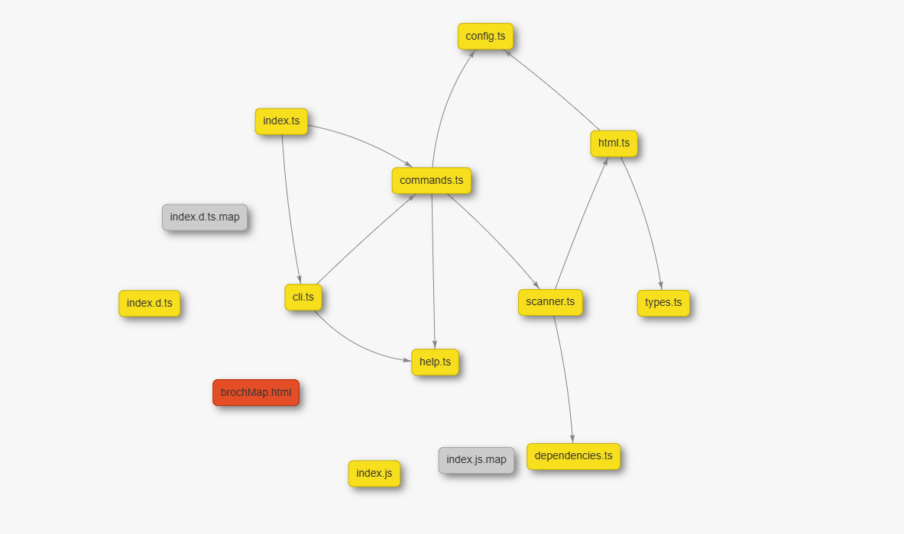

<div align="center">

<p align="center">  </p>

<h1 align="center">Broch</h1>

<p align="center">
  
  
  
  
  
</p>

<p align="center">
  <a href="README.md">English</a> |
  <a href="README.es.md">Español</a> |
  <a href="README.zh.md">中文</a> |
  <a href="README.ja.md">日本語</a>
</p>

<p align="center"> <strong>Visualize your project's architecture in a simple and interactive way.</strong> </p>

## 📑 Table of Contents
- [Main Features](#-main-features)
- [Installation](#-installation)
- [Commands](#️-commands)
  - [map](#map)
  - [preview](#preview)
  - [version](#version)
  - [help](#help)
- [Configuration](#-configuration)
- [License](#-license)
- [Contributing to Broch](#-contributing-to-broch)
- [Code of Conduct](#-code-of-conduct)
- [Quick Commands](#-quick-commands)
- [Footer Links](#-footer-links)

Broch is a command-line interface (CLI) tool designed to analyze your project's structure and generate an interactive dependency map. With Broch, you can get a clear and graphical view of how your files are interconnected, making it easier to understand, maintain, and debug your code.

## ✨ Main Features
Automatic Dependency Analysis: Detects import, require, include, and more relationships in JavaScript, TypeScript, HTML, CSS, and PHP files.

Interactive Visualization: Generates a dynamic HTML map using vis-network that allows you to explore your project's connections intuitively.

High Customization: Configure colors, labels, and output filename through a simple **broch.config.json** file.

Easy to Use: With just a couple of commands, you can have a complete view of your project's architecture.

## 🚀 Installation
To start using Broch, make sure you have Node.js (version 12 or higher) installed on your system. Then, install the package globally through npm:

```bash
npm i -g broch
```

By installing it globally, you'll be able to run the broch command from any directory.

## ⚙️ Commands
Broch is very simple to use. Here are the available commands.

```bash
broch map
```
This is the heart of Broch. It scans a directory (of your choice) and generates the dependency map.

Alias:
```bash
broch m
```

**Usage Examples:**

Scan selected directory: Simply run the command in your project's root, and broch will give you a list of current directories, select the one you want, and you're done.



##

```bash
broch preview
```
Once you've generated the map, this command will allow you to open it directly in your browser.

Alias:
```bash
broch p
```

Usage Example:

This command will look for the brochMap.html file (or the name you've configured) and open it.

##

```bash
broch version
```

Shows the version of Broch you have installed.

Alias:

```bash
broch v
```

##

```bash
broch
```
```bash
broch help
```
Shows a summary of available commands and options.

Alias:
```bash
broch h
```

## 🔧 Configuration (broch.config.json)

```json
{
  "outputFileName": "brochMap.html",
  "colors": {
    "html": "#E44D26",
    "css": "#1572B6",
    "js": "#F7DF1E",
    "php": "#777BB4",
    "image": "#4CAF50",
    "rust": "#DE3423",
    "json": "#000000",
    "yml": "#cb171e",
    "md": "#000000",
    "py": "#3776AB",
    "java": "#b07219",
    "other": "#CCCCCC"
  },
  "labels": {
    "js": "JS/TS",
    "yml": "YML",
    "md": "Markdown",
    "py": "Python",
    "java": "Java"
  }
}
```

##

The first time you run Broch, a broch.config.json file will be automatically created in your directory. This file allows you to customize the tool according to your preferences.

**outputFileName:** Define the name of the HTML file that will be generated.

**colors:** Assign a color to each file type according to its extension. Feel free to add or modify as many as you want!

**labels:** Allows you to define custom labels for the color legend in the map, making visualization even clearer.

## 📄 License MIT
Copyright © 2025 Jan Queralt

Hereby, permission is granted, free of charge, to any person obtaining a copy
of this software and associated documentation files (the "Software"), to deal
in the Software without restriction, including without limitation the rights
to use, copy, modify, merge, publish, distribute, sublicense, and/or sell
copies of the Software, and to permit persons to whom the Software is
furnished to do so, subject to the following conditions:

The above copyright notice and this permission notice shall be included in all
copies or substantial portions of the Software.

THE SOFTWARE IS PROVIDED "AS IS", WITHOUT WARRANTY OF ANY KIND, EXPRESS OR
IMPLIED, INCLUDING BUT NOT LIMITED TO WARRANTIES OF MERCHANTABILITY,
FITNESS FOR A PARTICULAR PURPOSE AND NONINFRINGEMENT. IN NO EVENT SHALL THE
AUTHORS OR COPYRIGHT HOLDERS BE LIABLE FOR ANY CLAIM, DAMAGES OR OTHER
LIABILITY, WHETHER IN AN ACTION OF CONTRACT, TORT OR OTHERWISE, ARISING FROM,
OUT OF OR IN CONNECTION WITH THE SOFTWARE OR THE USE OR OTHER DEALINGS IN THE
SOFTWARE.

# 🤝 Contributing to Broch

First off, thank you for considering contributing to Broch! Your help is essential for keeping it great.

Contributions are what make the open-source community such an amazing place to learn, inspire, and create. Any contributions you make are **greatly appreciated 💕**.

We welcome contributions of all kinds, including bug reports, feature requests, documentation improvements, and code enhancements.

##  Ways to Contribute

### Reporting Bugs or Suggesting Features
Before creating a new contribution, please check the [Issues page](https://github.com/jaanque/broch/issues) to see if a similar one already exists.

-   **To report a bug:** Please open an issue and provide as much detail as possible, including steps to reproduce it, the expected outcome, and the actual result. The more information, the better!
-   **To suggest a feature:** Open an issue and describe your idea, explaining why you think it would be a valuable addition to Broch.

### Submitting a Pull Request (PR)
If you want to contribute with code, please follow these steps:

1.  **Fork the Repository**
    Click the "Fork" button at the top right of this page to create your own copy of the repository.

2.  **Clone Your Fork**
    Clone the repository to your local machine:
    ```bash
    git clone 
    https://github.com/YOUR_USERNAME/broch.git
    ```
    ```bash
    cd broch
    ```

3.  **Set Up Your Environment**
    Install the project dependencies and link your local copy to make the `broch` command available globally for testing.
    ```bash
    # Install dependencies
    npm install

    # Link the package to use the 'broch' command locally
    npm link
    ```
    and if npm link doesn't work try

    ```bash
    npm link broch
    ```

    The `npm link` command is crucial as it allows you to run and test your local version of Broch from any directory on your system.

4.  **Create a New Branch**
    Create a descriptive branch for your changes. It's a good practice to name it based on the feature or fix you are working on.
    ```bash
    # Example for a new feature
    git checkout -b feature/add-new-parser

    # Example for a bug fix
    git checkout -b fix/resolve-rendering-issue
    ```

5.  **Make Your Changes**
    Write your code, fix the bug, or improve the documentation. Make sure your changes are clean and follow the existing code style.

6.  **Commit Your Changes**
    Commit your changes with a clear and concise message, following conventional commit standards if possible.
    ```bash
    git commit -m "feat: Add support for YAML configuration files"
    ```

7.  **Push to Your Fork**
    Push your changes to your forked repository.
    ```bash
    git push origin feature/add-new-parser
    ```

8.  **Open a Pull Request**
    Go to the original Broch repository and open a new Pull Request. Provide a clear title and a detailed description of the changes you've made, linking to any relevant issues.

## Code of Conduct
To ensure our community is welcoming and respectful, please read and follow our [Code of Conduct](CODE_OF_CONDUCT.md). By participating in this project, you agree to abide by its terms.

Thank you again for your interest in contributing to Broch!

<footer align="center">
<hr>

<p>
<a href="README.md">English</a> ·
<a href="README.es.md">Español</a> ·
<a href="README.zh.md">中文</a> ·
<a href="README.ja.md">日本語</a>
</p>

<p>
<a href="#-main-features">Features</a> ·
<a href="#-installation">Installation</a> ·
<a href="#️-commands">Commands</a> ·
<a href="#-configuration">Configuration</a> ·
<a href="#-license">License</a> ·
<a href="#-contributing-to-broch">Contribution</a> ·
<a href="CODE_OF_CONDUCT.md">Code of Conduct</a> ·
<a href="https://github.com/jaanque/broch">Repository</a> ·
<a href="https://github.com/jaanque/broch/issues">Issues</a> ·
<a href="https://www.npmjs.com/package/broch">NPM</a>
</p>

<p>
<strong>Quick commands:</strong>
<code>broch map</code> · <code>broch preview</code> · <code>broch version</code> · <code>broch help</code>
</p>

<p>
<small>© 2025 Jan Queralt · MIT License · To contribute or report issues, open an Issue in the repository.</small>
</p>
</footer>

</div>